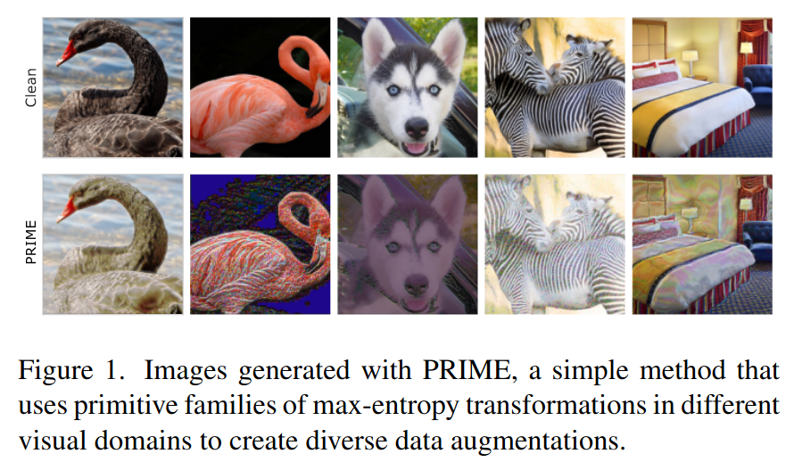

# PRIME: A Few Primitives Can Boost Robustness to Common Corruptions

This is the official repository of PRIME, the data agumentation method introduced in the ECCV 2022 paper [*"PRIME: A Few Primitives Can Boost Robustness to Common Corruptions"*](https://arxiv.org/abs/2112.13547). PRIME is a generic, plug-n-play data augmentation scheme that consists of simple families of max-entropy image transformations for conferring robustness against common corruptions. PRIME leads to significant improvements in corruption robustness on multiple benchmarks. 
<p align="center">
    
</p>

## Pre-trained models

We provide different models trained with PRIME on CIFAR-10/100 and ImageNet datasets. You can download them from [here](https://zenodo.org/record/5801872#.YcSPahPP08M).

## Setup

This code has been tested with `Python 3.8.5` and `PyTorch 1.9.1`. To install required dependencies run:
```sh
$ pip install -r requirements.txt
```
For corruption robustness evaluation, download and extract the CIFAR-10-C, CIFAR-100-C and ImageNet-C datasets from [here](https://github.com/hendrycks/robustness).

## Usage

We provide a script [`train.py`](train.py) for PRIME training on CIFAR-10/100, ImageNet-100 and ImageNet. For example, to train a ResNet-50 network on ImageNet with PRIME, run:
```sh
$ python -u train.py --config=config/imagenet_cfg.py \
    --config.save_dir=<save_dir> \
    --config.data_dir=<data_dir> \
    --config.cc_dir=<common_corr_dir> \
    --config.use_prime=True
```
Detailed configuration options for all the datasets can be found in [`config`](config/).

## Results

Results on ImageNet/ImageNet-100 with a ResNet-50/ResNet-18 (&dagger;: without JSD loss)
| Dataset | Method | &nbsp;Clean &#8593;&nbsp; | CC Acc &#8593; | &nbsp;&nbsp;mCE &#8595;&nbsp; |
|:---:|---|:---:|:---:|:---:|
| ImageNet | Standard | 76.1 | 38.1 | 76.1 |
| ImageNet | AugMix | 77.5 | 48.3 | 65.3 |
| ImageNet | DeepAugment | 76.7 | 52.6 | 60.4 |
| ImageNet | PRIME&dagger; | 77.0 | **55.0** | **57.5** |
| ImageNet | PRIME | 75.3 | **56.4** | **55.5** |
| ImageNet-100 | Standard | 88.0 | 49.7 | 100.0 |
| ImageNet-100 | AugMix | 88.7 | 60.7 | 79.1 |
| ImageNet-100 | DeepAugment | 86.3 | 67.7 | 68.1 |
| ImageNet-100 | PRIME | 85.9 | **71.6** | **61.0** |

Results on CIFAR-10/100 with a ResNet-18
| &nbsp;&nbsp;&nbsp;&nbsp;&nbsp;Dataset&nbsp;&nbsp;&nbsp;&nbsp; | &nbsp;&nbsp;&nbsp;&nbsp;Method&nbsp;&nbsp;&nbsp;&nbsp;&nbsp; | &nbsp;Clean &#8593; | CC Acc &#8593;&nbsp; | &nbsp;&nbsp;mCE &#8595;&nbsp; |
|:---:|---|:---:|:---:|:---:|
| CIFAR-10 | Standard | 95.0 | 74.0 | 24.0 |
| CIFAR-10 | AugMix | 95.2 | 88.6 | 11.4 |
| CIFAR-10 | PRIME | 93.1 | **89.0** | **11.0** |
| CIFAR-100 | Standard | 76.7 | 51.9 | 48.1 |
| CIFAR-100 | AugMix | 78.2 | 64.9 | 35.1 |
| CIFAR-100 | PRIME | 77.6 | **68.3** | **31.7** |

## Citing this work

```
@inproceedings{PRIME2022,
    title = {PRIME: A Few Primitives Can Boost Robustness to Common Corruptions}, 
    author = {Apostolos Modas and Rahul Rade and Guillermo {Ortiz-Jim\'enez} and Seyed-Mohsen {Moosavi-Dezfooli} and Pascal Frossard},
    year = {2022},
    booktitle = {European Conference on Computer Vision (ECCV)}
}
```
